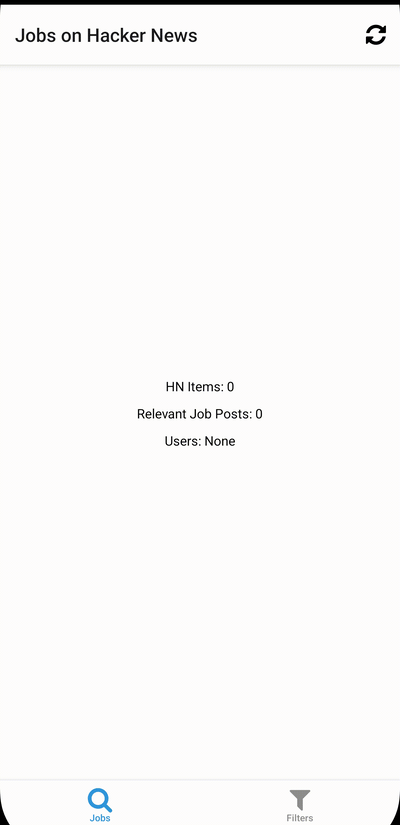

# Hacker News Job Search App

This application helps you search for job postings on Hacker News. The app is built using React Native and uses the Hacker News API to fetch job postings.

### How do I use the application?

Once it is in a useful state, I will publish it on the iOS App Store and Google Play Store.

### Current State

The app is currently in development stage. The basic functionality of fetching job postings from the Hacker News API is implemented. However, the user interface and additional features are still under development.

Below is the plan of action for development. The checked items are already done:
- [x] Integrate with the Hacker News API to fetch job postings.
- [ ] Provide a user-friendly interface to view job postings.
- [ ] Let you filter jobs based on various keyword filters.
- [ ] Initiate process to publish the application on app stores.
- [ ] Let you search live for specific keywords in job postings.
- [ ] Let you save jobs to a list of favorites.
